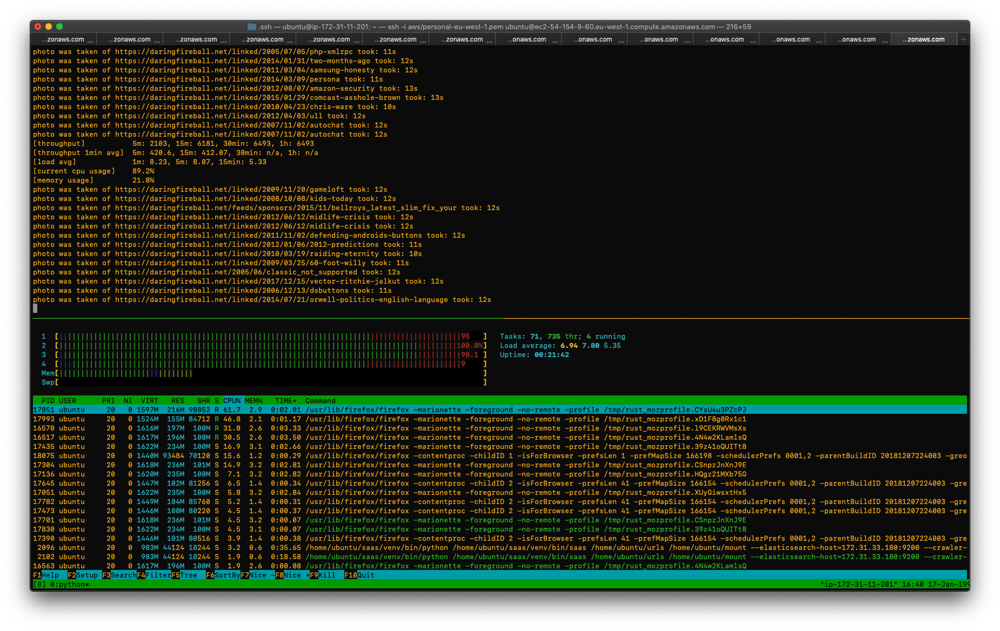
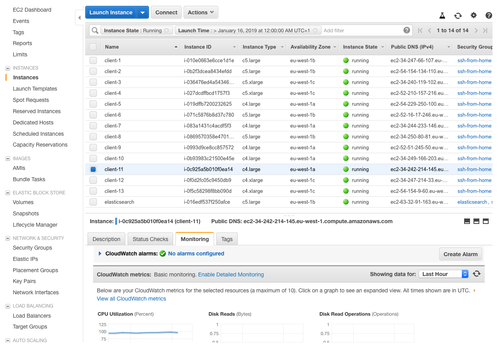

# Maximize saas throughput - Guide

This guide will show you how to setup saas in a configuration with more than one server. Saaas uses elasticsearch as an index for urls and photos that have been taken. This allows for virtually unlimited amount of saas clients working with the same index. All machines need to have access to the same data directory, this guide will show you how to setup a shared network drive on aws, using EFS, but the same principles should apply to other cloud platform providers.



## Servers

This guide will refer to these types of servers

- client server, this will run saas
- index server, this will run an elasticsearch instance

## Prerequisites

This guide assumes you are running on `Ubuntu 18.04.1 LTS` but the steps will be similar for most linux distributions.

This guide will mostly use `c5.large` instances, it's fine for this guide but for a production environment other instance types might suit better.

## Step 1, Configure the index server

### Install docker

To install elasticsearch in this guide, docker will be used

Install docker if not installed, see the full instructions at the [docker website](https://docs.docker.com/install/linux/docker-ce/ubuntu/)

```bash
sudo apt-get update

sudo apt-get install \
    apt-transport-https \
    ca-certificates \
    curl \
    gnupg2 \
    software-properties-common

curl -fsSL https://download.docker.com/linux/ubuntu/gpg | sudo apt-key add -

sudo add-apt-repository \
    "deb [arch=amd64] https://download.docker.com/linux/ubuntu \
    $(lsb_release -cs) \
    stable"

sudo apt-get update

sudo apt-get install docker-ce

# verify docker installation
sudo docker run hello-world
```

### Install elasticsearch

Pull the elasticsearch image

See the full instructions at [elastic's website](https://www.elastic.co/guide/en/elasticsearch/reference/current/docker.html)

```bash
sudo docker pull docker.elastic.co/elasticsearch/elasticsearch:6.5.4
```

Start elasticsearch

```bash
sudo docker run -p 9200:9200 -e "discovery.type=single-node" docker.elastic.co/elasticsearch/elasticsearch:6.5.4
```

## Step 2, Configure a saas server

### Installing python 3.7

__Saas requires python 3.7__, which is currently not the default python version or pre-installed on most systems. Neither are there any trusted repositories with python 3.7.

To install python 3.7 you could compile it [from source yourself](https://www.python.org/downloads/source/), but for this guide we'll use [pyenv](https://github.com/pyenv/pyenv)

Install pyenv

```bash
curl -L https://github.com/pyenv/pyenv-installer/raw/master/bin/pyenv-installer | bash
```

Add the following lines to your bash profile

```bash
export PATH="/home/ubuntu/.pyenv/bin:$PATH"
eval "$(pyenv init -)"
eval "$(pyenv virtualenv-init -)"
```

Run `exec "$SHELL"` to restart the shell

Install a few dependencies needed to compile python

```bash
sudo apt-get install build-essential python-dev python-setuptools python-pip python-smbus libncursesw5-dev libgdbm-dev libc6-dev zlib1g-dev tk-dev libssl-dev openssl libffi-dev
```

Install python 3.7.2

```bash
pyenv install 3.7.2
pyenv global 3.7.2
python --version
# Python 3.7.2
```

### Install Firefox

Saas uses firefox to render webpages and [selenium](https://github.com/SeleniumHQ/selenium) to communicate with firefox. Selenium depends on [geckodriver by mozilla](https://github.com/mozilla/geckodriver), so we'll need to install that as well.

```bash
# install firefox
sudo apt-get install firefox

# install geckodriver
wget https://github.com/mozilla/geckodriver/releases/download/v0.23.0/geckodriver-v0.23.0-linux64.tar.gz
tar -xvzf geckodriver-v0.23.0-linux64.tar.gz
chmod +x geckodriver
sudo mv geckodriver /usr/bin/
```

### Installing saas

Create virtual environment and install saas

```bash
python -m venv ./venv
source ./venv/bin/activate

python -m pip install saas

saas --version
# saas 1.1.1
```

## Step 3, Configure networking

This will differ depending on your cloud provider, the following example is for AWS EC2.

- Create a security group with tcp port 2049 open for inbound traffic (for EFS Filesystem)
- Create a security group for elasticsearch, that allows inboud tcp traffic on port 9200, from the previous security group

- Assign the first security group to the client server
- Assign the second security group to the index server

Verify that networking has been connected correctly. From the client server, run

```bash
curl http://INDEX_PRIVATE_IP:9200
{
  "name" : "jocv01f",
  "cluster_name" : "docker-cluster",
  "cluster_uuid" : "ZHgMDae1Rgu16DcnGJds_A",
  "version" : {
    "number" : "6.5.4",
    "build_flavor" : "default",
    "build_type" : "tar",
    "build_hash" : "d2ef93d",
    "build_date" : "2018-12-17T21:17:40.758843Z",
    "build_snapshot" : false,
    "lucene_version" : "7.5.0",
    "minimum_wire_compatibility_version" : "5.6.0",
    "minimum_index_compatibility_version" : "5.0.0"
  },
  "tagline" : "You Know, for Search"
}
```

## Step 4, Test run saas

```bash

mkdir ~/mount
touch ~/urls

# start saas
saas ~/urls ~/mount --clear-elasticsearch --elasticsearch-host=INDEX_PRIVATE_IP:9200
```

You should now have saas running connected to the index.

To add a url do the following

```bash
echo "https://news.ycombinator.com/" > urls
```

## Step 5, Scaling it up

### Create shared datadir

This will also differ depending on your cloud provider, and the following will be for AWS only.

Create an [EFS Filesystem](https://aws.amazon.com/efs/) through the aws console

```bash
# install efs utils
sudo apt-get -y install binutils
git clone https://github.com/aws/efs-utils && cd efs-utils
./build-deb.sh
sudo apt-get -y install ./build/amazon-efs-utils*deb

# mount the filesystem
sudo mkdir /mnt/efs
sudo sh -c "echo 'EFS_FILESYSTEM_ID:/ /mnt/efs efs defaults,_netdev 0 0' >> /etc/fstab"
sudo mount -a
```

Create data directory

```bash
sudo mkdir /mnt/efs/datadir
sudo chown -R ubuntu:ubuntu /mnt/efs/datadir
```

### Create AMI

Create an image of the fuse instance.

Spawn new instances from the AMI, as many as you need.



## Some Results

The biggest bottleneck is rendering, and the best way to ensure fast render times is a fixed viewport size and a stay on non-image-heavy sites.

```bash
saas ~/urls ~/mount --setup-elasticsearch \
    --elasticsearch-host=PRIVATE_IP:9200 \
    --crawler-threads=2 \
    --photographer-threads=5 \
    --refresh-rate=day \
    --data-dir=/mnt/efs/datadir \
    --clear-data-dir \
    --stay-at-domain \
    --viewport-width=1024 \
    --viewport-height=1024
```

```bash
echo "https://daringfireball.net/" > urls
```

A 1 hour test generated the following stats (load, cpu and memory are for the single instance - throughput is cluster wide). The resulting photographs took up `549.8 MiB` of EFS space.

```bash
[throughput]           5m: 2036, 15m: 5957, 30min: 11877, 1h: 24040
[throughput 1min avg]  5m: 407.2, 15m: 397.13, 30min: 395.9, 1h: 400.67
[load avg]             1m: 3.12, 5m: 3.42, 15min: 3.38
[current cpu usage]    82.6%
[memory usage]         25.5%
```

The one hour average of __400 photos rendered / minute__ results in

- __24 000 photos / hour__
- __576 000 photos / day__

The number of photos rendered per minute scales linearly with the number of instances running saas. So adding more instances will improve those numbers.
